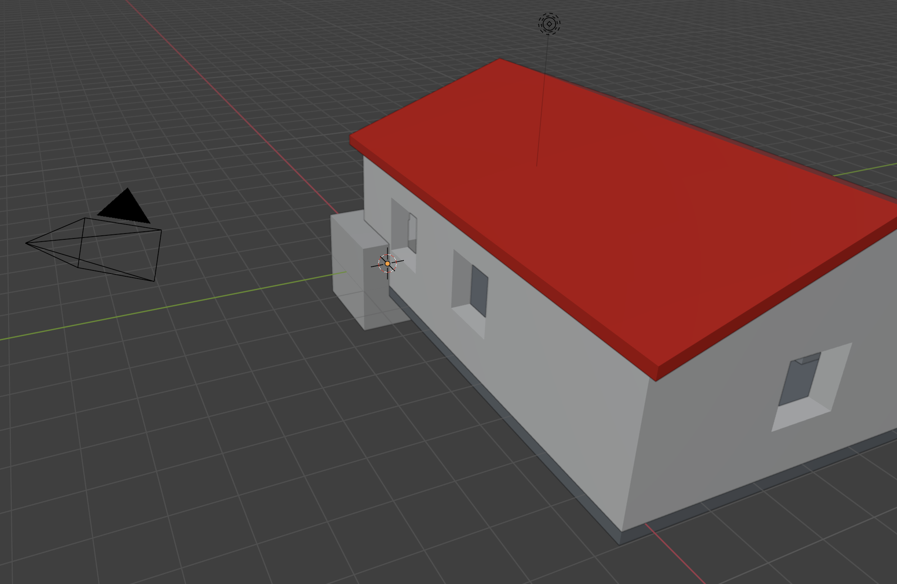
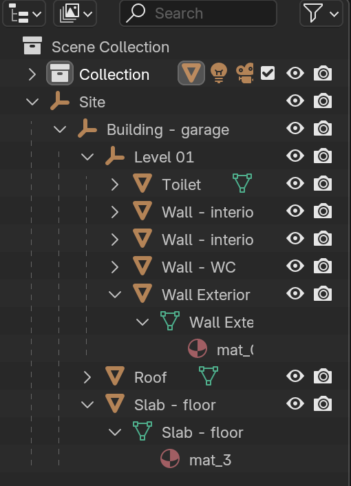
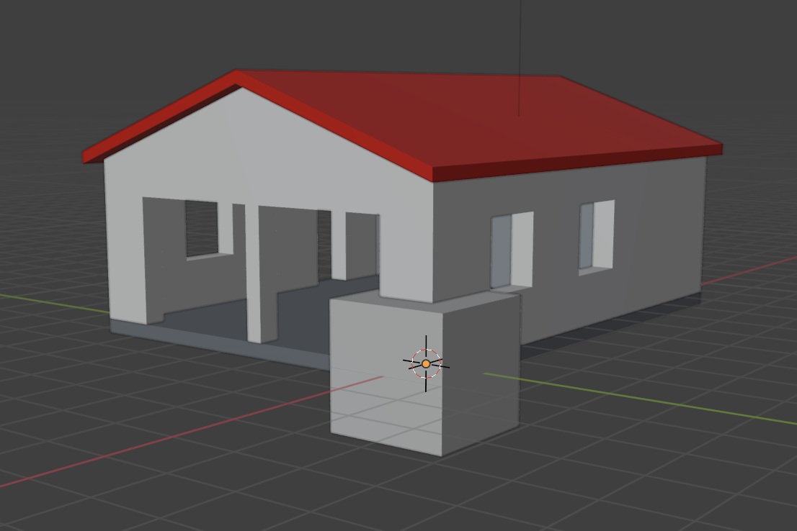
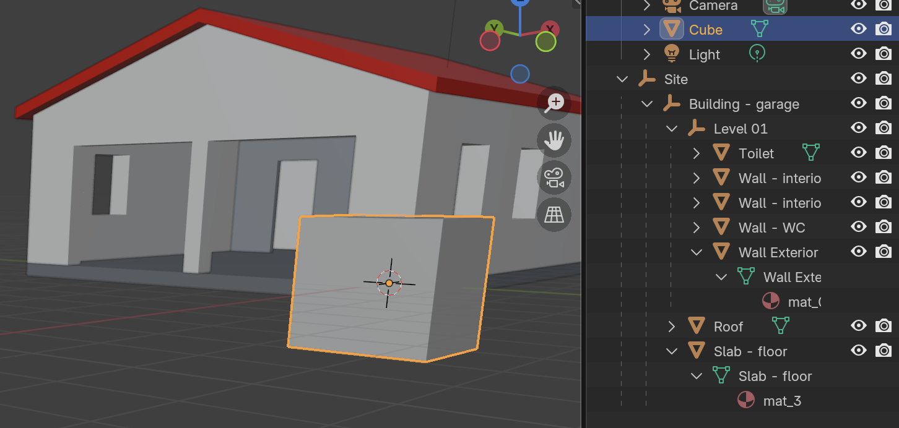
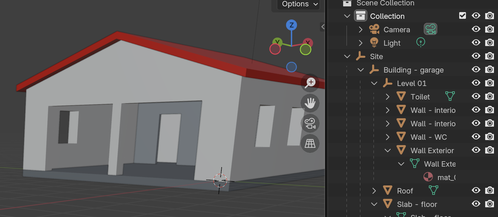
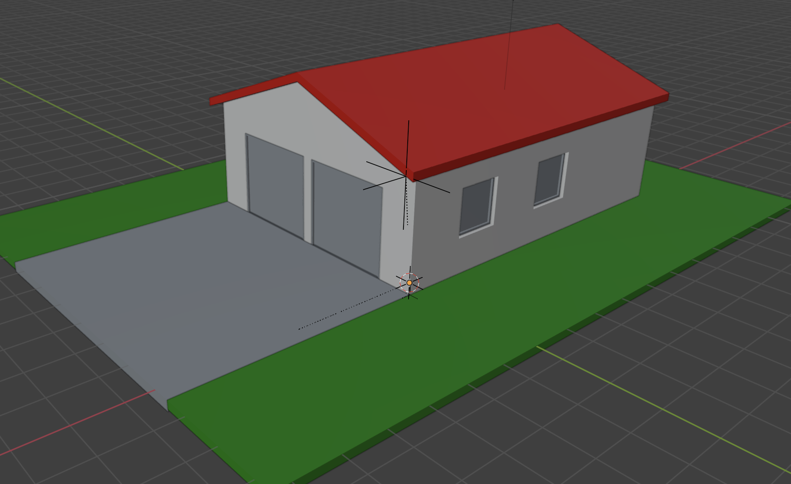
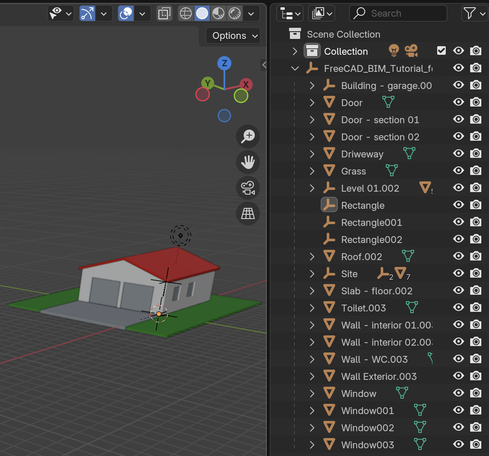
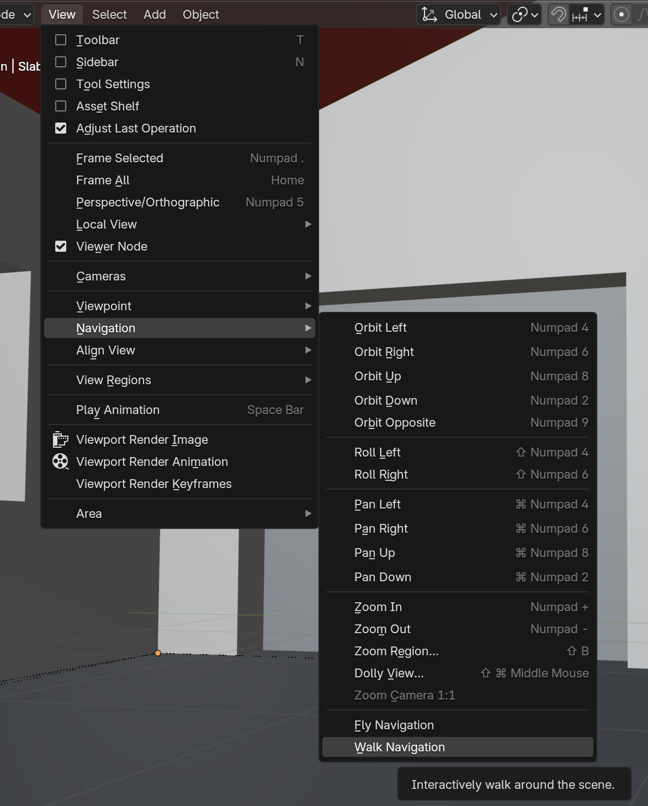
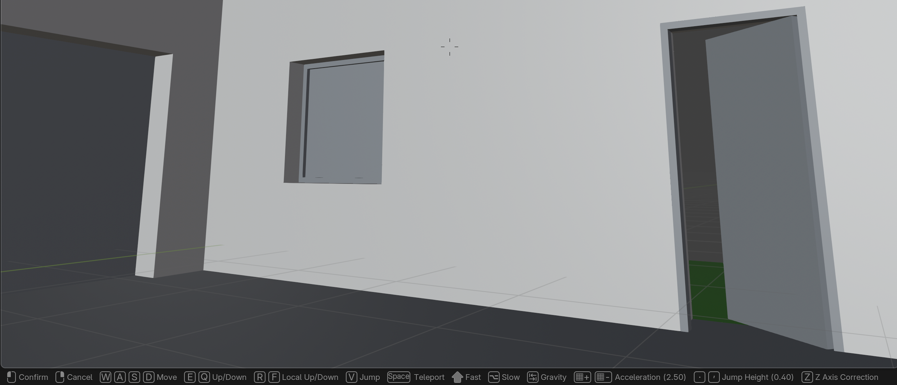

# My Abstract for using Blender on macbook Pro Apple Silicone

## Beware - Blender Navigation is opaque and nothing works on first startup

So I installed Blender 4.4 on my MAcbook Pro APple silicone and imported a hose model as gltf-file from Freecad.

The model was imported on and I could see it in Blender.

But I totally failed to navigate! Whatever I did nothing happens!

## Or Actually - Two fingers + Shift or option or command does Translate, Orbit and Zoom!

I am not sure why I missed this from the getgo. But if I use two fingers on the touchpad I can:

* Blender: Translate = Shift key + two-finger-swipe
* Blender: Rotate (orbit) = option key + two-finger-swipe
* Blender: Zoom = command key + two-finger-swipe

NOTE: This resembles Freecad 'touchpad' navigation:

* Freecad: Translate = Shift key + one-finger-swipe
* Freecad: Rotate = option key + one-finger-swipe
* Freecad: Zoom = two-finger-swipe up / down

## Beware that Freecad 'Blender' navigation does NOT behave like Blender on Macbook Pro touchpad

In Freecad I tried to set 'Blender' navigation in the hope that now I would get exactly the Blender 4.4 on touchpad behavior (see above).

But No! I get none of the two-finger-swipe behaviour I get in my Blender 4.4 on my Macbook pro.

## It seems GLTF-file Freecad to Blender means the model structure is preserved and available within Blender?

I succeeded to export my house model from Freecad and import it to Blender. And I found that the 'Scene Collection' tree view now has the 'levels' I defined in Freecad BIM Workbensh with 'Site' as the root.

## Beware the default Cube in Blender!

I was a bit disappointed when I had imported my house into blender that it seemed the drivieway slab had been disformed into a 'chunk'.

But it turned out that the 'chunk' was just the default cube that blender inserts into any new project!

When I deleted the cube I had only the imported house model left ok.

## It seems Freecad Model Tree is NOT recursive, in that I need to expand and select all objects I want to export?

I tried selecting the top node in my House model (the 'Site' node) and then export it to GLTF (GL Transmisson Format). But when I imported it into Blender no door, windows where present in the model. Also the grass and front driveway was also missing.

I went back to Freecad end expanded my model tree. Then I selected ALL items in the tree by selecting the first and last node with the Shift-key. Now the import into Blender gets everything (including 2D drawings).

And I could see each and every one of the objects in Blender Scene Collection ok.

## It seems GLTF is 'GL Transmission Format' that represents 3D models as meshes, materials and textures?

Also see [Wikipedia article glTF](https://en.wikipedia.org/wiki/GlTF)

*"glTF (Graphics Library Transmission Format or GL Transmission Format and formerly known as WebGL Transmissions Format or WebGL TF) is a standard file format for three-dimensional scenes and models"*

## It seems View -> Navigation -> Walk allows me to wal into my and around my house?

If I select the main view 'Layout' and then sub-meu 'View' and Navigation and 'Walk Navigation' I can actually manouver into my house an walk around it!

At the bottom on the view I get instructions on what keys to press to 'walk'. So far I have used only W,S (forward and backward translation) and S,D (left and right translation).

To 'turn' I can single-finger-drag on the tranckpad.

It is kind of cool to 'be' in my house model!

